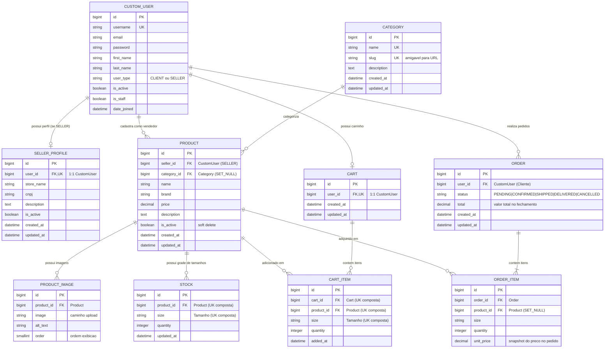

# Arquitetura do Sistema — Marketplace de Calçados

> Versão: 1.0 | Sprint 1

---

## Visão Geral

O marketplace de calçados segue uma arquitetura **monolítica web** com Django, adequada para
a escala e complexidade do projeto acadêmico. A arquitetura foi escolhida por:

- Simplicidade operacional (um único processo)
- Coesão entre camadas (models, views, templates no mesmo framework)
- Facilidade de manutenção pela equipe
- Suporte nativo do Django para autenticação, admin, ORM e migrations

---

## Diagrama de Arquitetura

```
┌─────────────────────────────────────────────────────────┐
│                    CLIENTE (Browser)                    │
│            Chrome / Firefox / Edge / Safari             │
└─────────────────────────┬───────────────────────────────┘
                          │ HTTP/HTTPS
                          ▼
┌─────────────────────────────────────────────────────────┐
│                   DJANGO (Backend)                      │
│                                                         │
│  ┌─────────┐   ┌──────────┐   ┌──────────────────────┐ │
│  │  URLs   │──▶│  Views   │──▶│  Templates (HTML)    │ │
│  └─────────┘   └────┬─────┘   └──────────────────────┘ │
│                     │                                   │
│  ┌──────────────────▼────────────────────────────────┐  │
│  │                   Models (ORM)                    │  │
│  │  users │ products │ cart │ orders                 │  │
│  └──────────────────┬────────────────────────────────┘  │
│                     │                                   │
└─────────────────────┼───────────────────────────────────┘
                      │ psycopg2
                      ▼
┌─────────────────────────────────────────────────────────┐
│                   PostgreSQL                            │
│           Banco de dados relacional principal           │
└─────────────────────────────────────────────────────────┘
```

---

## Responsabilidades do Django

| Responsabilidade | Mecanismo Django |
|------------------|-----------------|
| Autenticação e sessão | `django.contrib.auth` + `AbstractUser` |
| Autorização por tipo de usuário | `user_type` no `CustomUser` |
| Regras de negócio | Models e Views |
| Comunicação com banco | ORM + `psycopg2` |
| Proteção CSRF | `CsrfViewMiddleware` |
| Administração | `django.contrib.admin` |
| Migrations | `django.db.migrations` |
| Arquivos estáticos | `django.contrib.staticfiles` |

---

## Estrutura de Apps

```
apps/
├── users/      → Usuários, autenticação e perfil do vendedor
├── products/   → Catálogo, categorias, imagens e estoque
├── cart/       → Carrinho de compras e seus itens
└── orders/     → Pedidos e itens de pedido
```

### Dependências entre Apps

```
users  ←──── products  ←──── cart
                │
                └──────────── orders
```

> **Regra**: apps de nível superior não importam de apps de nível inferior.
> `products` referencia `users` (vendedor). `cart` e `orders` referenciam `products`.

---

## Modelo de Dados — Entidades Principais e DER

### Diagrama de Entidade e Relacionamento (Mermaid)



<details>
<summary><b>Clique para expandir e copiar o código-fonte Mermaid</b></summary>

```text
erDiagram
    CUSTOM_USER ||--o| SELLER_PROFILE : "possui perfil (se SELLER)"
    CUSTOM_USER ||--o{ PRODUCT : "cadastra como vendedor"
    CUSTOM_USER ||--o| CART : "possui carrinho"
    CUSTOM_USER ||--o{ ORDER : "realiza pedidos"

    CATEGORY ||--o{ PRODUCT : "categoriza"

    PRODUCT ||--o{ PRODUCT_IMAGE : "possui imagens"
    PRODUCT ||--o{ STOCK : "possui grade de tamanhos"
    PRODUCT ||--o{ CART_ITEM : "adicionado em"
    PRODUCT ||--o{ ORDER_ITEM : "adquirido em"

    CART ||--o{ CART_ITEM : "contem itens"
    ORDER ||--|{ ORDER_ITEM : "contem itens"

    CUSTOM_USER {
        bigint id PK
        string username UK
        string email
        string password
        string first_name
        string last_name
        string user_type "CLIENT ou SELLER"
        boolean is_active
        boolean is_staff
        datetime date_joined
    }

    SELLER_PROFILE {
        bigint id PK
        bigint user_id FK,UK "1:1 CustomUser"
        string store_name
        string cnpj
        text description
        boolean is_active
        datetime created_at
        datetime updated_at
    }

    CATEGORY {
        bigint id PK
        string name UK
        string slug UK "amigavel para URL"
        text description
        datetime created_at
        datetime updated_at
    }

    PRODUCT {
        bigint id PK
        bigint seller_id FK "CustomUser (SELLER)"
        bigint category_id FK "Category (SET_NULL)"
        string name
        string brand
        decimal price
        text description
        boolean is_active "soft delete"
        datetime created_at
        datetime updated_at
    }

    PRODUCT_IMAGE {
        bigint id PK
        bigint product_id FK "Product"
        string image "caminho upload"
        string alt_text
        smallint order "ordem exibicao"
    }

    STOCK {
        bigint id PK
        bigint product_id FK "Product (UK composta)"
        string size "Tamanho (UK composta)"
        integer quantity
        datetime updated_at
    }

    CART {
        bigint id PK
        bigint user_id FK,UK "1:1 CustomUser"
        datetime created_at
        datetime updated_at
    }

    CART_ITEM {
        bigint id PK
        bigint cart_id FK "Cart (UK composta)"
        bigint product_id FK "Product (UK composta)"
        string size "Tamanho (UK composta)"
        integer quantity
        datetime added_at
    }

    ORDER {
        bigint id PK
        bigint user_id FK "CustomUser (Cliente)"
        string status "PENDING|CONFIRMED|SHIPPED|DELIVERED|CANCELLED"
        decimal total "valor total no fechamento"
        datetime created_at
        datetime updated_at
    }

    ORDER_ITEM {
        bigint id PK
        bigint order_id FK "Order"
        bigint product_id FK "Product (SET_NULL)"
        string size
        integer quantity
        decimal unit_price "snapshot do preco no pedido"
    }
```
</details>

### Dicionário de Entidades e Restrições de Dados

| Entidade / Tabela | App Django | Descrição | Principais Restrições e Chaves |
|---|---|---|---|
| **`CUSTOM_USER`** | `users` | Usuário central (`AbstractUser`) | `user_type`: `CLIENT` ou `SELLER`. Chave primária `id`. |
| **`SELLER_PROFILE`** | `users` | Perfil da loja do vendedor | Relação `1:1` com `CustomUser` (`limit_choices_to={'user_type': 'SELLER'}`). |
| **`CATEGORY`** | `products` | Categorias de calçados (ex: Tênis, Bota) | `name` e `slug` únicos (`UK`). |
| **`PRODUCT`** | `products` | Calçado ofertado no catálogo | `FK` para `CustomUser` (vendedor) e `FK` anulável para `Category`. Campo `is_active` para desativação lógica (*soft delete*). |
| **`PRODUCT_IMAGE`** | `products` | Galeria de fotos do produto | `FK` para `Product`, ordenação via `order`. |
| **`STOCK`** | `products` | Grade de estoque por tamanho | `FK` para `Product`. `unique_together = ('product', 'size')`. |
| **`CART`** | `cart` | Carrinho de compras | Relação `1:1` com `CustomUser`. |
| **`CART_ITEM`** | `cart` | Itens no carrinho | `FK` para `Cart` e `Product`. `unique_together = ('cart', 'product', 'size')`. |
| **`ORDER`** | `orders` | Pedido realizado pelo cliente | `FK` para `CustomUser`. `status` (`PENDING`, `CONFIRMED`, `SHIPPED`, `DELIVERED`, `CANCELLED`) e snapshot do total. |
| **`ORDER_ITEM`** | `orders` | Itens dentro de um pedido | `FK` para `Order` e `FK` para `Product` com `on_delete=SET_NULL`. Snapshot de preço (`unit_price`) no momento da compra. |

---

## Decisões de Design

### 1. CustomUser antes da primeira migration
O modelo `CustomUser` foi criado e configurado como `AUTH_USER_MODEL` antes de qualquer migration.
Mudar o modelo de usuário depois da primeira migration é extremamente complexo.

### 2. Snapshot de preço em OrderItem
`OrderItem.unit_price` armazena o preço no momento da compra.
Se o vendedor alterar o preço do produto, pedidos anteriores não são afetados.

### 3. Soft delete em produtos
`Product.is_active = False` desativa o produto sem excluí-lo.
Isso preserva a integridade referencial com pedidos e itens de carrinho existentes.

### 4. CartItem.unique_together
Evita que o mesmo produto no mesmo tamanho apareça duas vezes no carrinho.
A lógica de "atualizar quantidade" substituirá inserção duplicada.

### 5. Sem microsserviços
Arquitetura monolítica Django. Adequada ao escopo e à equipe do projeto acadêmico.

---

## Segurança

- `SECRET_KEY` carregada via variável de ambiente
- `DEBUG=False` em produção
- Senhas hasheadas via PBKDF2 (AbstractUser)
- Proteção CSRF ativa por padrão (`CsrfViewMiddleware`)
- Validação de dados via Django Forms
- `.env` não versionado no Git

---

## Configuração de Ambiente

```
Desenvolvimento: DEBUG=True, banco local PostgreSQL
Produção:        DEBUG=False, ALLOWED_HOSTS configurado, banco externo
```
