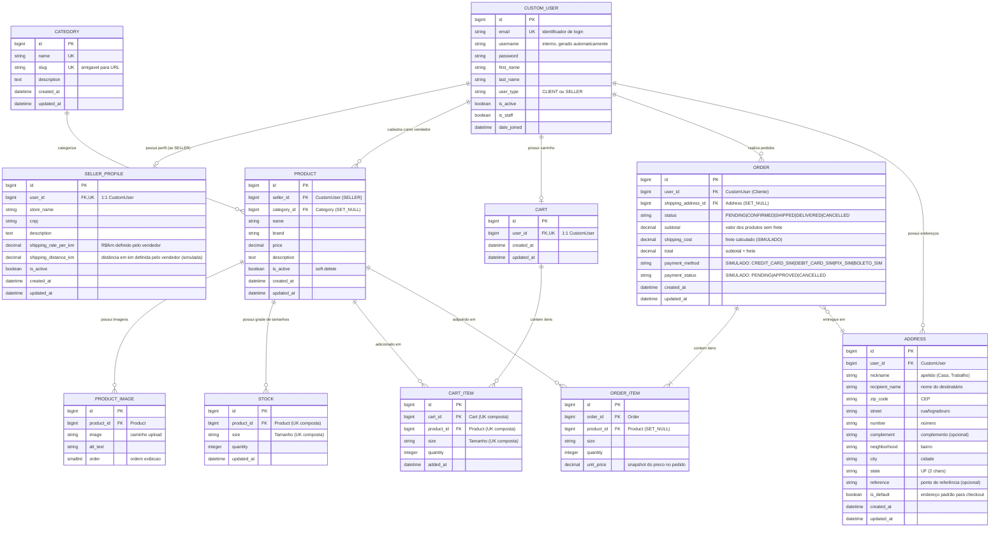

# Arquitetura do Sistema — Marketplace de Calçados

> Versão: 1.1 | Atualizado na Sprint 2 (decisões de negócio)

---

## Visão Geral

O marketplace de calçados segue uma arquitetura **monolítica web** com Django, adequada para
a escala e complexidade do projeto acadêmico. A arquitetura foi escolhida por:

- Simplicidade operacional (um único processo)
- Coesão entre camadas (models, views, templates no mesmo framework)
- Facilidade de manutenção pela equipe
- Suporte nativo do Django para autenticação, admin, ORM e migrations

---

## Diagrama de Arquitetura

```
┌─────────────────────────────────────────────────────────┐
│                    CLIENTE (Browser)                    │
│            Chrome / Firefox / Edge / Safari             │
└─────────────────────────┬───────────────────────────────┘
                          │ HTTP/HTTPS
                          ▼
┌─────────────────────────────────────────────────────────┐
│                   DJANGO (Backend)                      │
│                                                         │
│  ┌─────────┐   ┌──────────┐   ┌──────────────────────┐ │
│  │  URLs   │──▶│  Views   │──▶│  Templates (HTML)    │ │
│  └─────────┘   └────┬─────┘   └──────────────────────┘ │
│                     │                                   │
│  ┌──────────────────▼────────────────────────────────┐  │
│  │                   Models (ORM)                    │  │
│  │  users │ products │ cart │ orders                 │  │
│  └──────────────────┬────────────────────────────────┘  │
│                     │                                   │
└─────────────────────┼───────────────────────────────────┘
                      │ psycopg2
                      ▼
┌─────────────────────────────────────────────────────────┐
│                   PostgreSQL                            │
│           Banco de dados relacional principal           │
└─────────────────────────────────────────────────────────┘
```

---

## Responsabilidades do Django

| Responsabilidade | Mecanismo Django |
|------------------|-----------------|
| Autenticação e sessão | `django.contrib.auth` + `AbstractUser` + `EmailBackend` customizado |
| Login por e-mail | `USERNAME_FIELD = 'email'` + `apps.users.backends.EmailBackend` |
| Autorização por tipo de usuário | `user_type` no `CustomUser` |
| Regras de negócio | Models e Views |
| Comunicação com banco | ORM + `psycopg2` |
| Proteção CSRF | `CsrfViewMiddleware` |
| Administração | `django.contrib.admin` |
| Migrations | `django.db.migrations` |
| Arquivos estáticos | `django.contrib.staticfiles` |

---

## Estrutura de Apps

```
apps/
├── users/      → Usuários, autenticação por e-mail, endereços e perfil do vendedor
├── products/   → Catálogo, categorias, imagens e estoque
├── cart/       → Carrinho de compras e seus itens
└── orders/     → Pedidos, pagamento simulado e itens de pedido
```

### Dependências entre Apps

```
users  ←──── products  ←──── cart
  ↑              │
  │              └──────────── orders
  └──────────────────────────── orders (shipping_address → users.Address)
```

> **Regra**: apps de nível superior não importam de apps de nível inferior.
> `products` referencia `users` (vendedor). `cart` e `orders` referenciam `products`.
> `orders` referencia `users.Address` (endereço de entrega).

---

## Modelo de Dados — Entidades Principais e DER

### Diagrama de Entidade e Relacionamento (Mermaid)



### Dicionário de Entidades e Restrições de Dados

| Entidade / Tabela | App Django | Descrição | Principais Restrições e Chaves |
|---|---|---|---|
| **`CUSTOM_USER`** | `users` | Usuário central (`AbstractUser`) | `email` único (`UK`), usado como identificador de login (`USERNAME_FIELD`). `user_type`: `CLIENT` ou `SELLER`. |
| **`SELLER_PROFILE`** | `users` | Perfil da loja do vendedor | Relação `1:1` com `CustomUser`. `shipping_rate_per_km` e `shipping_distance_km` para cálculo de frete. |
| **`ADDRESS`** | `users` | Endereço de entrega do usuário | `FK` para `CustomUser`. Um usuário pode ter múltiplos endereços. Campo `is_default` marca o endereço padrão para checkout. |
| **`CATEGORY`** | `products` | Categorias de calçados (ex: Tênis, Bota) | `name` e `slug` únicos (`UK`). |
| **`PRODUCT`** | `products` | Calçado ofertado no catálogo | `FK` para `CustomUser` (vendedor) e `FK` anulável para `Category`. Campo `is_active` para desativação lógica (*soft delete*). |
| **`PRODUCT_IMAGE`** | `products` | Galeria de fotos do produto | `FK` para `Product`, ordenação via `order`. |
| **`STOCK`** | `products` | Grade de estoque por tamanho | `FK` para `Product`. `unique_together = ('product', 'size')`. |
| **`CART`** | `cart` | Carrinho de compras | Relação `1:1` com `CustomUser`. |
| **`CART_ITEM`** | `cart` | Itens no carrinho | `FK` para `Cart` e `Product`. `unique_together = ('cart', 'product', 'size')`. |
| **`ORDER`** | `orders` | Pedido realizado pelo cliente | `FK` para `CustomUser` e `FK` anulável para `Address`. Campos de frete (`subtotal`, `shipping_cost`, `total`) e pagamento simulado (`payment_method`, `payment_status`). |
| **`ORDER_ITEM`** | `orders` | Itens dentro de um pedido | `FK` para `Order` e `FK` para `Product` com `on_delete=SET_NULL`. Snapshot de preço (`unit_price`) no momento da compra. |

---

## Decisões de Design

### 1. CustomUser antes da primeira migration
O modelo `CustomUser` foi criado e configurado como `AUTH_USER_MODEL` antes de qualquer migration.
Mudar o modelo de usuário depois da primeira migration é extremamente complexo.

### 2. Login por e-mail (não username)
O campo `email` é o identificador principal de login (`USERNAME_FIELD = 'email'`, `unique=True`).
O campo `username` é mantido internamente pelo `AbstractUser` mas preenchido automaticamente
a partir da parte local do e-mail durante o cadastro — não é exposto nos formulários públicos.
O backend `apps.users.backends.EmailBackend` substitui o comportamento padrão do Django.

### 3. Múltiplos endereços por usuário
`Address` é uma entidade separada com `FK` para `CustomUser`.
Um usuário pode cadastrar vários endereços. O campo `is_default` pré-seleciona um endereço no checkout.
O checkout sempre utiliza um dos endereços cadastrados — nunca um campo avulso.

### 4. Frete configurado pelo vendedor (SIMULADO)
O vendedor configura dois campos em `SellerProfile`:
- `shipping_rate_per_km`: valor em R$ por quilômetro.
- `shipping_distance_km`: distância estimada em km para entrega (escolhida pelo vendedor).

**Fórmula**: `frete = shipping_distance_km × shipping_rate_per_km`

**Limitação documentada**: Não há integração com API de mapas ou geolocalização nesta versão.
A distância é informada pelo próprio vendedor no perfil da loja.
A arquitetura permite substituir o `calculate_shipping()` por um cálculo real via API futuramente.

### 5. Pagamento simulado (sem processamento financeiro real)
**NÃO há integração com Mercado Pago, Stripe, PIX real, cartão real ou qualquer gateway de pagamento.**
O sistema registra o método e status de pagamento apenas para fins acadêmicos e de demonstração.

Campos em `Order`:
- `payment_method`: método escolhido pelo usuário (`CREDIT_CARD_SIM`, `DEBIT_CARD_SIM`, `PIX_SIM`, `BOLETO_SIM`).
- `payment_status`: status simulado (`PENDING`, `APPROVED`, `CANCELLED`).

O pagamento é sempre aprovado imediatamente após o usuário confirmar, simulando uma transação bem-sucedida.

### 6. Snapshot de preço em OrderItem
`OrderItem.unit_price` armazena o preço no momento da compra.
Se o vendedor alterar o preço do produto, pedidos anteriores não são afetados.

### 7. Soft delete em produtos
`Product.is_active = False` desativa o produto sem excluí-lo.
Isso preserva a integridade referencial com pedidos e itens de carrinho existentes.

### 8. CartItem.unique_together
Evita que o mesmo produto no mesmo tamanho apareça duas vezes no carrinho.
A lógica de "atualizar quantidade" substituirá inserção duplicada.

### 9. Sem microsserviços
Arquitetura monolítica Django. Adequada ao escopo e à equipe do projeto acadêmico.

---

## Fluxo de Checkout

```
Usuário autenticado
  → Visualiza carrinho
  → Seleciona endereço de entrega (Address cadastrado)
  → Sistema calcula frete: SellerProfile.shipping_distance_km × shipping_rate_per_km
  → Sistema exibe: subtotal + frete + total
  → Usuário seleciona método de pagamento (simulado)
  → Usuário confirma pedido
  → Sistema cria Order com payment_status = APPROVED (simulado)
  → Sistema desconta estoque
  → Usuário vê confirmação do pedido
```

> **IMPORTANTE**: O pagamento é inteiramente simulado. Nenhuma cobrança financeira real é realizada.

---

## Segurança

- `SECRET_KEY` carregada via variável de ambiente
- `DEBUG=False` em produção
- Senhas hasheadas via PBKDF2 (AbstractUser)
- Proteção CSRF ativa por padrão (`CsrfViewMiddleware`)
- Validação de dados via Django Forms
- `.env` não versionado no Git
- Autenticação por e-mail com backend customizado (timing-attack safe)

---

## Configuração de Ambiente

```
Desenvolvimento: DEBUG=True, banco local PostgreSQL
Produção:        DEBUG=False, ALLOWED_HOSTS configurado, banco externo
```
